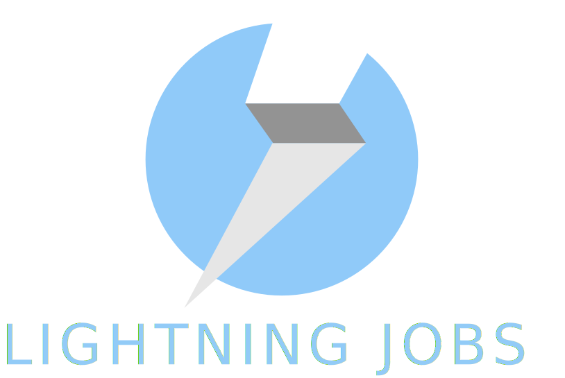
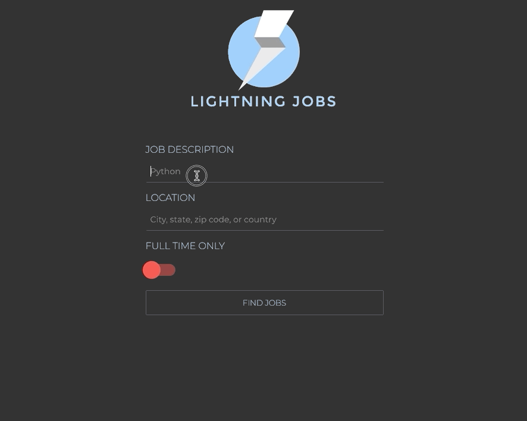

<p align="center">

</p>

# Preview



# Technologies Used 

* React.js
* React router
* styled-components
* date-fns
* Python
* Flask

# System Requirements
* Node
* npm
* python3
* pip
* venv


# Running Locally

Clone the repository and change directories
  ```
  git clone https://github.com/dm-altair/lightning-jobs.git
  cd lightning-jobs
  ```


#### Start the React app


1. Navigate to the `lightning-jobs/client` directory
1. Run `npm install` to install dependencies
1. Run `npm start` to start the React app

#### Start the Flask proxy server
1. Open a new terminal window
1. Navigate to the `lightning-jobs/server` directory
1. Run the following commands to create and activate a virtual environment
   ```
   python3 -m venv env
   source env/bin/activate
   ```
1. Run `pip install -r requirements` to install dependencies   
1. Run `python3 app.py` to start the Flask proxy server
1. To exit the virtual environment, stop the Flask server and run `deactivate` 
